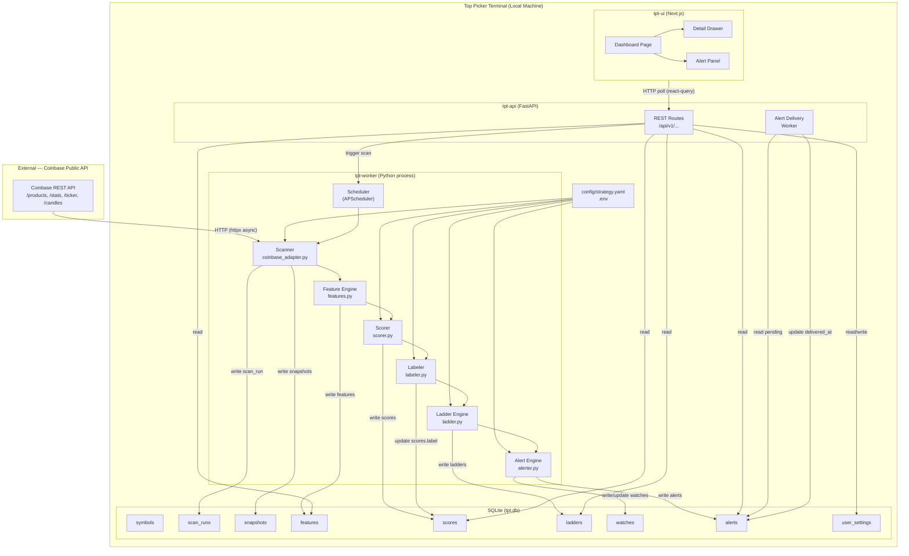

# Architecture — Top Picker Terminal (TPT) v1

**Document version:** 1.0
**Date:** 2026-09-05

---

## Table of Contents

1. [System Overview](#1-system-overview)
2. [System Diagram](#2-system-diagram)
3. [Module Boundaries](#3-module-boundaries)
4. [Data Flow](#4-data-flow)
5. [Component Details](#5-component-details)
6. [Rate-Limit Strategy](#6-rate-limit-strategy)
7. [Failure Modes & Mitigations](#7-failure-modes--mitigations)
8. [Technology Decisions](#8-technology-decisions)
9. [Future Extension Points](#9-future-extension-points)

---

## 1. System Overview

TPT runs as a **single-machine, local-first** application composed of two primary processes:

| Process | Role |
|---|---|
| **Server & Scanner** (`tpt serve`) | Single Python process running FastAPI + in-process APScheduler. Serves API requests AND executes 24/7 background market scans. Writes to SQLite in WAL mode. |
| **Frontend** (`tpt-ui`) | Next.js dev/prod web app; polls backend API; renders dashboard and drawer. |

All data is stored in a local **SQLite database file (`tpt.db`)**. The background scanner is the **sole writer** to market tables; API read endpoints execute concurrently over WAL connections with zero lock contention. Strategy configuration (`config/strategy.yaml`) is hot-reloaded by the scanner at the start of each scan run. Quiet hours suppress UI alert delivery (00:00–07:59 Nairobi) while background scans continue 24/7.

---

## 2. System Diagram



---

## 3. Module Boundaries

### 3.1 Backend Package Structure

```
backend/
├── tpt/
│   ├── __init__.py
│   ├── cli.py                  # CLI entry points (scan, serve, migrate)
│   ├── config/
│   │   ├── __init__.py
│   │   ├── settings.py         # Pydantic-settings; reads .env
│   │   └── strategy.py         # Loads and validates strategy.yaml
│   ├── adapters/
│   │   ├── __init__.py
│   │   ├── base.py             # ExchangeAdapter ABC
│   │   └── coinbase.py         # Coinbase REST adapter (httpx async)
│   ├── scanner/
│   │   ├── __init__.py
│   │   ├── runner.py           # Orchestrates a full scan run
│   │   └── scheduler.py        # APScheduler setup
│   ├── engine/
│   │   ├── __init__.py
│   │   ├── features.py         # Pure feature computation functions
│   │   ├── scorer.py           # Pure scoring function (dict → score_breakdown)
│   │   ├── labeler.py          # Pure labeling function (features → label)
│   │   └── ladder.py           # Pure ladder computation
│   ├── alerting/
│   │   ├── __init__.py
│   │   ├── alerter.py          # Alert generation & dedupe logic
│   │   └── delivery.py         # Delivery worker (in-app; Telegram stub)
│   ├── db/
│   │   ├── __init__.py
│   │   ├── connection.py       # SQLAlchemy engine + session factory
│   │   ├── models.py           # ORM models (mirrors DATA_MODEL.md)
│   │   └── migrations/         # Alembic migration scripts
│   └── api/
│       ├── __init__.py
│       ├── main.py             # FastAPI app factory
│       ├── middleware.py       # CORS, logging middleware
│       └── routes/
│           ├── markets.py
│           ├── scan.py
│           ├── alerts.py
│           ├── config.py
│           ├── watchlist.py
│           └── health.py
├── config/
│   └── strategy.yaml
├── tests/
│   ├── unit/
│   │   ├── test_features.py
│   │   ├── test_scorer.py
│   │   ├── test_labeler.py
│   │   └── test_ladder.py
│   ├── integration/
│   │   ├── test_scanner.py
│   │   └── test_alerts.py
│   └── fixtures/
│       └── sample_snapshot.json
├── pyproject.toml
├── .env.example
└── Makefile
```

### 3.2 Module Responsibilities

| Module | Inputs | Outputs | External I/O? |
|---|---|---|---|
| `adapters/coinbase` | symbol list, config | Raw market dicts | ✅ (Coinbase REST) |
| `scanner/runner` | config, adapter | scan_run record, raw snapshots | ✅ (writes DB) |
| `engine/features` | raw snapshot dict | feature dict | ❌ (pure) |
| `engine/scorer` | feature dict, strategy config | score_breakdown dict | ❌ (pure) |
| `engine/labeler` | feature dict, score, config | label string | ❌ (pure) |
| `engine/ladder` | feature dict, label, config | ladder dict | ❌ (pure) |
| `alerting/alerter` | new scan results, DB state | alert records | ✅ (reads/writes DB) |
| `alerting/delivery` | alert records | delivered alerts | ✅ (UI push / TG) |
| `api/*` | HTTP requests | HTTP responses | ✅ (reads DB) |

**Key architectural invariant:** All `engine/` modules are pure functions. No DB access, no I/O. This enables fast unit testing and score reproducibility from stored snapshots.

---

## 4. Data Flow

### 4.1 Scheduled Scan Flow

```
Scheduler (every N seconds)
  │
  ▼
scanner/runner.py  ─── start_scan_run() → scan_run record (status=RUNNING)
  │
  ├── adapters/coinbase.py
  │     ├── GET /products → product list (filtered)
  │     ├── [parallel, rate-limited] GET /stats × N symbols
  │     ├── [parallel, rate-limited] GET /ticker × N symbols
  │     └── [parallel, rate-limited] GET /candles × candidates only
  │
  ├── Persist snapshots → snapshots table
  │
  ├── [for each symbol]
  │     ├── engine/features.py(snapshot) → feature dict
  │     ├── engine/scorer.py(features, config) → score + breakdown
  │     ├── engine/labeler.py(features, score, config) → label
  │     └── engine/ladder.py(features, label, config) → ladder (or None)
  │
  ├── Bulk write features, scores, ladders → DB
  │
  ├── alerting/alerter.py
  │     ├── Load previous scan state from DB
  │     ├── Compare current vs previous for zone entry/exit
  │     ├── Apply dedupe logic
  │     └── Write new alerts → alerts table
  │
  └── Complete scan_run record (status=DONE, duration, errors)
```

### 4.2 UI Data Flow

```
Browser (Next.js)
  │
  ├── react-query polls GET /api/v1/markets every 5s (idle) / 1s (scanning)
  ├── react-query polls GET /api/v1/scan/status every 2s
  ├── react-query polls GET /api/v1/alerts every 10s
  │
  └── On row click → GET /api/v1/markets/{symbol} → populates drawer
```

### 4.3 On-Demand Scan Flow

```
User clicks "Scan Now"
  │
  ▼
POST /api/v1/scan/trigger
  │
  ▼
FastAPI route → enqueue scan job in APScheduler (one-shot)
  │
  ▼
Returns { scan_run_id, status: "queued" }
  │
  ▼
UI polls GET /api/v1/scan/status until status ≠ RUNNING
```

---

## 5. Component Details

### 5.1 Rate Limiter (Token Bucket)

Implemented in `adapters/coinbase.py` as an `asyncio`-compatible token bucket:

```python
class RateLimiter:
    def __init__(self, rate: float = 3.0):  # tokens per second
        self._rate = rate
        self._tokens = rate
        self._last_refill = time.monotonic()
        self._lock = asyncio.Lock()

    async def acquire(self) -> None:
        async with self._lock:
            now = time.monotonic()
            elapsed = now - self._last_refill
            self._tokens = min(self._rate, self._tokens + elapsed * self._rate)
            self._last_refill = now
            if self._tokens < 1:
                wait = (1 - self._tokens) / self._rate
                await asyncio.sleep(wait)
                self._tokens = 0
            else:
                self._tokens -= 1
```

### 5.2 Candle Fetching Strategy

To keep the scan under 30s, candles are fetched **only for candidate symbols** (non-SKIP, non-CHASE):

1. Phase 1: Fetch stats + ticker for ALL symbols (~100–200 calls).
2. Phase 2: Apply pre-filter: eliminate SKIP and CHASE using stats data alone.
3. Phase 3: Fetch candles only for remaining candidates (typically 20–40 symbols).

This reduces candle fetches from ~200 to ~40, dramatically reducing API time.

### 5.3 Concurrency Model

- Scanner uses `asyncio` + `httpx.AsyncClient` with semaphore-limited concurrency (max 10 concurrent requests).
- FastAPI serves requests in the same event loop (single process).
- SQLite writes are serialized through a single `asyncio.Lock` in the scanner path.
- SQLAlchemy uses `aiosqlite` driver for async compatibility.

### 5.4 Config Hot-Reload

`strategy.yaml` stat is checked at the start of each scan run. If mtime changed, the config is reloaded before computing features/scores. This allows live threshold tuning without restarting the worker.

---

## 6. Rate-Limit Strategy

### Coinbase Public API Limits (as of 2026)

| Endpoint Category | Known Limit | Our Target |
|---|---|---|
| Public endpoints | ~10 req/s per IP | ≤ 3 req/s (conservative) |
| `/candles` | Max 300 candles per call | Use 1h/1d granularity |

### Strategy

| Situation | Action |
|---|---|
| Normal scan | Token bucket at 3 req/s; async concurrent with semaphore |
| 429 received | Exponential backoff: 2s, 4s, 8s, 16s, 32s, 60s (max); retry × 3 |
| Still 429 after 3 retries | Mark symbol as `stale`; continue with remaining symbols |
| Network timeout | Timeout = 10s per request; treat as failure → stale |
| IP ban (persistent 429 15min+) | Surface warning in UI; reduce scan frequency automatically |

### Request Budget Estimate (per scan run)

```
200 symbols × (1 stats + 1 ticker) = 400 requests
40 candidates × (1 candles_1h + 1 candles_1d) = 80 requests
1 products list = 1 request
─────────────────────────────────────────────
Total: ~481 requests at 3 req/s ≈ 160s theoretical

With concurrency (10 parallel, rate-limited): ≈ 25–35s actual
```

---

## 7. Failure Modes & Mitigations

| # | Failure | Detection | Mitigation |
|---|---|---|---|
| FM-1 | Coinbase API 429 rate limit | HTTP 429 response | Token bucket + backoff; partial scan |
| FM-2 | Coinbase endpoint unreachable | Network timeout / 5xx | Retry 3× then stale; previous scan data shown |
| FM-3 | SQLite file corruption | SQLAlchemy error on connect | Auto-backup on startup; clear error in UI |
| FM-4 | Scanner crash mid-run | `scan_run.status` left as RUNNING | Watchdog: if any RUNNING run is > 5min old, mark FAILED |
| FM-5 | `strategy.yaml` parse error | Pydantic validation error | Reject reload; keep previous config; log error |
| FM-6 | Clock skew (system clock reset) | UTC timestamps diverge | Dedupe uses monotonic offsets; alert if skew > 5min |
| FM-7 | Division by zero in pos_in_range | `day_high == day_low` | Clamp to 0.5; log warning |
| FM-8 | Stale previous scan (no baseline for dedupe) | `watches` table empty | First scan after startup fires no ZONE_ENTRY alerts; populate baseline silently |
| FM-9 | Port conflict (FastAPI port in use) | OS error on bind | Surface clear error; configurable port in `.env` |

---

## 8. Technology Decisions

### 8.1 Python 3.12 + FastAPI

- FastAPI's async first-class support matches httpx async scanner.
- Pydantic v2 for config validation.
- APScheduler for cron-style scheduling within same process.

### 8.2 SQLite → Postgres migration path

- Use SQLAlchemy Core (not ORM relationships) to keep queries portable.
- Alembic handles migrations; swapping `DATABASE_URL` in `.env` to `postgresql+asyncpg://...` is the only change needed.
- No SQLite-specific features used (e.g., avoid `RETURNING` if Postgres incompatibility matters).

### 8.3 Next.js (TypeScript) for UI

See PRD §13.1 for rationale. Key library choices:

| Library | Purpose |
|---|---|
| `@tanstack/react-query` | Server state, polling, caching |
| `shadcn/ui` (Radix primitives) | Table, Drawer, Toast, Badge |
| `recharts` or `react-sparklines` | Mini pos-in-range sparkbars |
| `date-fns-tz` | Timezone display (Africa/Nairobi) |

### 8.4 Packaging: `uv`

- Faster than pip/poetry for CI.
- `pyproject.toml` as single source of truth.
- Lock file committed for reproducibility.

---

## 9. Future Extension Points

| Extension | Where to Add | Effort Estimate |
|---|---|---|
| MEXC exchange | New `adapters/mexc.py` implementing `ExchangeAdapter` ABC | 2–3 days |
| Telegram alerts | Extend `alerting/delivery.py` with Telegram bot handler | 1 day |
| WebSocket live data | Add WS adapter alongside REST adapter | 2–3 days |
| Postgres backend | Change `DATABASE_URL`; run Alembic migrations | 0.5 days |
| P&L tracking | New `trades` table + UI P&L view | 2–3 days |
| Multi-profile | Add `profile_id` FK to all tables; auth layer | 3–5 days |

---

*End of ARCHITECTURE.md v1.0*
