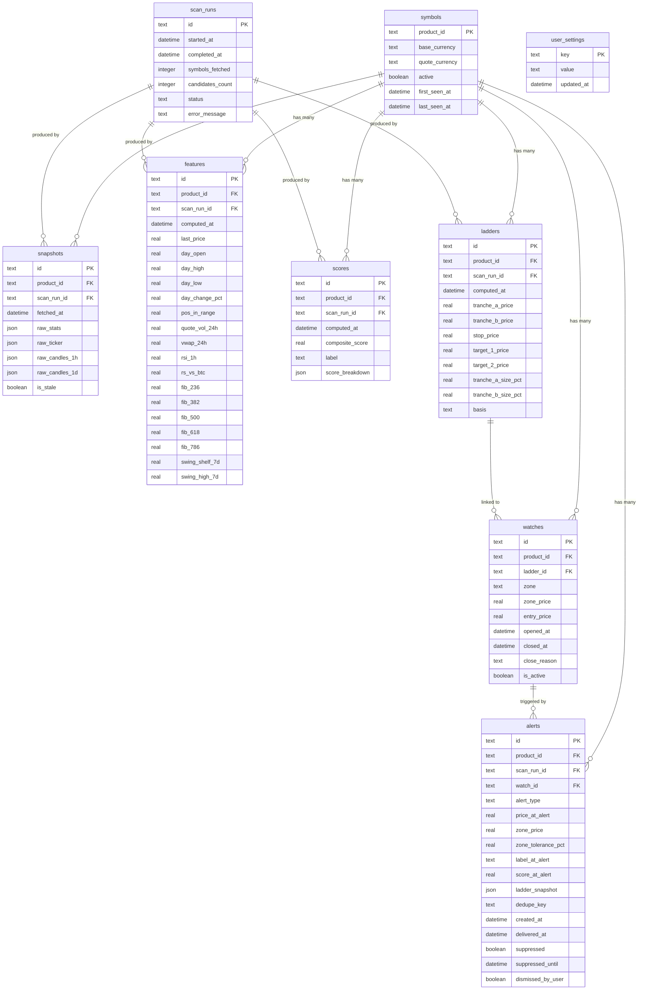

# Data Model — Top Picker Terminal (TPT) v1

**Document version:** 1.0
**Date:** 2026-09-05
**Database:** SQLite (via SQLAlchemy / aiosqlite); Postgres-compatible schema.

---

## Table of Contents

1. [Overview & Relationships](#1-overview--relationships)
2. [Table: symbols](#2-table-symbols)
3. [Table: scan_runs](#3-table-scan_runs)
4. [Table: snapshots](#4-table-snapshots)
5. [Table: features](#5-table-features)
6. [Table: scores](#6-table-scores)
7. [Table: ladders](#7-table-ladders)
8. [Table: watches](#8-table-watches)
9. [Table: alerts](#9-table-alerts)
10. [Table: user_settings](#10-table-user_settings)
11. [Indexes](#11-indexes)
12. [Retention Policy](#12-retention-policy)
13. [SQLAlchemy Model Notes](#13-sqlalchemy-model-notes)

---

## 1. Overview & Relationships



---

## 2. Table: `symbols`

Master catalog of tracked Coinbase USD products.

| Column | Type | Constraints | Description |
|---|---|---|---|
| `product_id` | TEXT | PK | Coinbase product ID, e.g. `ETH-USD` |
| `base_currency` | TEXT | NOT NULL | Base asset, e.g. `ETH` |
| `quote_currency` | TEXT | NOT NULL | Quote currency (always `USD` in v1) |
| `display_name` | TEXT | | Human-readable name from Coinbase |
| `min_market_funds` | REAL | | Minimum order size in USD |
| `active` | INTEGER | NOT NULL DEFAULT 1 | 1 = online on exchange |
| `on_watchlist` | INTEGER | NOT NULL DEFAULT 0 | 1 = user-pinned watchlist item |
| `first_seen_at` | TEXT | NOT NULL | ISO-8601 UTC, first scan date |
| `last_seen_at` | TEXT | NOT NULL | ISO-8601 UTC, most recent scan |

**Notes:**
- `product_id` is the natural key and matches Coinbase's `id` field exactly.
- `active` is updated each scan run from `GET /products`.
- SQLite stores timestamps as ISO-8601 TEXT; use `datetime()` functions for comparisons.

---

## 3. Table: `scan_runs`

Audit log of every scanner execution (scheduled or on-demand).

| Column | Type | Constraints | Description |
|---|---|---|---|
| `id` | TEXT | PK | UUID v4 |
| `trigger` | TEXT | NOT NULL | `SCHEDULED` \| `ON_DEMAND` |
| `started_at` | TEXT | NOT NULL | UTC ISO-8601 |
| `completed_at` | TEXT | | UTC ISO-8601; NULL if running |
| `duration_seconds` | REAL | | Wall-clock time for the scan |
| `symbols_fetched` | INTEGER | | Count of symbols attempted |
| `symbols_stale` | INTEGER | | Count of symbols that returned stale data |
| `candidates_count` | INTEGER | | Count of non-SKIP, non-CHASE symbols |
| `status` | TEXT | NOT NULL | `RUNNING` \| `DONE` \| `FAILED` |
| `error_message` | TEXT | | Last error if status=FAILED |
| `config_snapshot` | TEXT | | JSON snapshot of `strategy.yaml` used |

**Notes:**
- On startup, the watchdog looks for any `status = 'RUNNING'` row older than 5 minutes and marks it `FAILED`.
- `config_snapshot` enables reproducibility: given a scan_run, you can re-derive all scores.

---

## 4. Table: `snapshots`

Raw market data captured per symbol per scan. Source of truth for reproducibility.

| Column | Type | Constraints | Description |
|---|---|---|---|
| `id` | TEXT | PK | UUID v4 |
| `product_id` | TEXT | FK → symbols | |
| `scan_run_id` | TEXT | FK → scan_runs | |
| `fetched_at` | TEXT | NOT NULL | UTC ISO-8601 |
| `raw_stats` | TEXT | | JSON from `GET /products/{id}/stats` |
| `raw_ticker` | TEXT | | JSON from `GET /products/{id}/ticker` |
| `raw_candles_1h` | TEXT | | JSON array from `GET /candles?granularity=3600`; NULL if not fetched |
| `raw_candles_1d` | TEXT | | JSON array from `GET /candles?granularity=86400`; NULL if not fetched |
| `is_stale` | INTEGER | NOT NULL DEFAULT 0 | 1 = data fetch failed; columns may be NULL |

**Notes:**
- `raw_candles_*` are only populated for non-SKIP candidates (Phase 2 of scan).
- JSON stored as TEXT (SQLite has no native JSON column; use `json_extract()` if needed).
- Total size per symbol per scan: ~2–10 KB depending on candle presence.

---

## 5. Table: `features`

Derived numeric features computed from snapshot data. All values are floats.

| Column | Type | Constraints | Description |
|---|---|---|---|
| `id` | TEXT | PK | UUID v4 |
| `product_id` | TEXT | FK → symbols, NOT NULL | |
| `scan_run_id` | TEXT | FK → scan_runs, NOT NULL | |
| `computed_at` | TEXT | NOT NULL | UTC ISO-8601 |
| `last_price` | REAL | NOT NULL | Last traded price |
| `day_open` | REAL | | 24h open price |
| `day_high` | REAL | | 24h high price |
| `day_low` | REAL | | 24h low price |
| `day_change_pct` | REAL | | `((last - open) / open) * 100` |
| `pos_in_range` | REAL | | `(last - day_low) / (day_high - day_low)`; [0,1] |
| `quote_vol_24h` | REAL | | 24h traded volume in USD |
| `vwap_24h` | REAL | | Approximated 24h VWAP |
| `rsi_1h` | REAL | | 14-period RSI on 1h candles; NULL if candles not fetched |
| `rs_vs_btc` | REAL | | `day_change_pct - BTC_USD_day_change_pct`; NULL if BTC fetch failed |
| `fib_236` | REAL | | 23.6% retrace level: `day_high - 0.236 * (day_high - day_low)` |
| `fib_382` | REAL | | 38.2% retrace level |
| `fib_500` | REAL | | 50.0% retrace level |
| `fib_618` | REAL | | 61.8% retrace level |
| `fib_786` | REAL | | 78.6% retrace level |
| `swing_shelf_7d` | REAL | | Lowest daily pivot low in last 7 days; NULL if no candles |
| `swing_high_7d` | REAL | | Highest daily pivot high in last 7 days |
| `vol_7d_avg_usd` | REAL | | Average 24h quote volume over past 7 days (from 1d candles) |

**Computed fields (not stored, derived at query time if needed):**
- `price_vs_vwap_pct = ((last_price - vwap_24h) / vwap_24h) * 100`
- `in_vwap_pocket = abs(price_vs_vwap_pct) <= 0.5`

---

## 6. Table: `scores`

Score breakdown and label per symbol per scan.

| Column | Type | Constraints | Description |
|---|---|---|---|
| `id` | TEXT | PK | UUID v4 |
| `product_id` | TEXT | FK → symbols, NOT NULL | |
| `scan_run_id` | TEXT | FK → scan_runs, NOT NULL | |
| `computed_at` | TEXT | NOT NULL | UTC ISO-8601 |
| `composite_score` | REAL | NOT NULL | Final clamped score [0, 100] |
| `label` | TEXT | NOT NULL | `SKIP` \| `CHASE` \| `ENTRY_ZONE` \| `COILED` \| `EARLY` \| `WATCH` |
| `score_breakdown` | TEXT | NOT NULL | JSON: `{ "baseline": 50, "components": {...}, "total": ..., "clamped": ... }` |

**Label enum values:**

| Value | Meaning |
|---|---|
| `SKIP` | Below volume threshold; not worth displaying |
| `CHASE` | Blown-out; day change > 15% and near highs — no entry |
| `ENTRY_ZONE` | Price currently inside an actionable confluence zone |
| `COILED` | Low-change, mid-range, liquid — ideal pre-breakout setup |
| `EARLY` | Starting to move but not extended — entry still viable |
| `WATCH` | Trending; no current entry but monitor for pullback |

---

## 7. Table: `ladders`

Computed limit order levels for a symbol at a scan point.

| Column | Type | Constraints | Description |
|---|---|---|---|
| `id` | TEXT | PK | UUID v4 |
| `product_id` | TEXT | FK → symbols, NOT NULL | |
| `scan_run_id` | TEXT | FK → scan_runs, NOT NULL | |
| `computed_at` | TEXT | NOT NULL | UTC ISO-8601 |
| `tranche_a_price` | REAL | NOT NULL | Primary entry price (60% size) |
| `tranche_b_price` | REAL | NOT NULL | Deeper entry price (40% size) |
| `stop_price` | REAL | NOT NULL | Hard invalidation level |
| `target_1_price` | REAL | NOT NULL | First take-profit (day high reclaim) |
| `target_2_price` | REAL | | Second take-profit; NULL if no swing high available |
| `tranche_a_size_pct` | REAL | NOT NULL DEFAULT 60 | Size allocation percentage |
| `tranche_b_size_pct` | REAL | NOT NULL DEFAULT 40 | Size allocation percentage |
| `basis` | TEXT | | JSON: explanation of how levels were derived (e.g., "A=fib50; B=fib786; T2=swing_high") |
| `chase_blocked` | INTEGER | NOT NULL DEFAULT 0 | 1 = Chase rule was triggered; no ladder generated (label=CHASE) |

**Notes:**
- Rows only created for symbols where `label IN ('COILED', 'EARLY', 'ENTRY_ZONE')`.
- Ladder levels are re-computed every scan; historical rows are retained.
- `basis` JSON example: `{"tranche_a": "fib_50_vwap_pocket", "tranche_b": "fib_786", "stop": "3pct_below_B", "t1": "day_high_reclaim", "t2": "swing_high_7d"}`

---

## 8. Table: `watches`

Lifecycle tracker for active zone watches. One watch per symbol per zone activation event.

| Column | Type | Constraints | Description |
|---|---|---|---|
| `id` | TEXT | PK | UUID v4 |
| `product_id` | TEXT | FK → symbols, NOT NULL | |
| `ladder_id` | TEXT | FK → ladders | The ladder that spawned this watch |
| `zone` | TEXT | NOT NULL | `TRANCHE_A` \| `TRANCHE_B` \| `BREAKOUT` \| `INVALIDATION` |
| `zone_price` | REAL | NOT NULL | Reference zone price level |
| `entry_price` | REAL | | Actual price when zone was first entered |
| `exit_price` | REAL | | Price when zone was exited (NULL if still active) |
| `opened_at` | TEXT | NOT NULL | UTC ISO-8601 — first scan detecting zone entry |
| `closed_at` | TEXT | | UTC ISO-8601 — scan detecting zone exit; NULL if active |
| `close_reason` | TEXT | | `PRICE_EXIT` \| `INVALIDATION` \| `TARGET_HIT` \| `MANUAL` \| `EXPIRED` |
| `is_active` | INTEGER | NOT NULL DEFAULT 1 | 1 = currently inside zone |

**Notes:**
- A watch is **opened** when the current scan detects zone entry and no active watch exists for that symbol+zone.
- A watch is **closed** when price exits the zone by more than `EXIT_TOLERANCE` (default 1.5%).
- Closing a watch resets the dedupe clock for the corresponding `dedupe_key`.
- A watch can re-open for the same symbol+zone after it is closed.

---

## 9. Table: `alerts`

Persistent record of every alert event (fired, suppressed, or dismissed).

| Column | Type | Constraints | Description |
|---|---|---|---|
| `id` | TEXT | PK | UUID v4 |
| `product_id` | TEXT | FK → symbols, NOT NULL | |
| `scan_run_id` | TEXT | FK → scan_runs | |
| `watch_id` | TEXT | FK → watches | |
| `alert_type` | TEXT | NOT NULL | `ZONE_A_ENTRY` \| `ZONE_B_ENTRY` \| `ZONE_A_APPROACH` \| `BREAKOUT_WATCH` \| `INVALIDATION` \| `DIGEST` |
| `price_at_alert` | REAL | NOT NULL | |
| `zone_price` | REAL | | Reference zone price |
| `zone_tolerance_pct` | REAL | | Tolerance used for zone detection |
| `label_at_alert` | TEXT | | Label at time of alert |
| `score_at_alert` | REAL | | Score at time of alert |
| `ladder_snapshot` | TEXT | | JSON copy of ladder levels at alert time |
| `dedupe_key` | TEXT | NOT NULL | `"{symbol}:{alert_type}:{zone_price_rounded}"` |
| `created_at` | TEXT | NOT NULL | UTC ISO-8601 |
| `delivered_at` | TEXT | | UTC ISO-8601; NULL = not yet delivered |
| `suppressed` | INTEGER | NOT NULL DEFAULT 0 | 1 = suppressed by quiet hours |
| `suppressed_until` | TEXT | | UTC ISO-8601 next delivery attempt |
| `dismissed_by_user` | INTEGER | NOT NULL DEFAULT 0 | 1 = user dismissed via UI |

**Notes:**
- `ladder_snapshot` ensures the alert retains its level data even if the ladder is re-computed later.
- `dedupe_key` is indexed for fast lookup during alert generation.
- DIGEST alerts have `alert_type = 'DIGEST'` and reference multiple suppressed alerts (linked via watch_id or stored as JSON array in `ladder_snapshot`).

---

## 10. Table: `user_settings`

Simple key-value store for runtime config overrides (overrides `strategy.yaml` defaults).

| Column | Type | Constraints | Description |
|---|---|---|---|
| `key` | TEXT | PK | Setting identifier |
| `value` | TEXT | NOT NULL | String-serialized value (numbers, booleans, JSON) |
| `updated_at` | TEXT | NOT NULL | UTC ISO-8601 |
| `description` | TEXT | | Human-readable description of the setting |

**Known keys:**

| Key | Default | Description |
|---|---|---|
| `min_quote_volume` | `1000000` | Minimum USD volume to include a symbol |
| `scan_interval_seconds` | `300` | Seconds between scheduled scans |
| `dedupe_hours` | `6` | Hours before same alert can re-fire |
| `quiet_hours_start` | `00:00` | Start of quiet window (Nairobi time) |
| `quiet_hours_end` | `07:59` | End of quiet window (Nairobi time) |
| `alert_digest_time` | `08:00` | Time to deliver morning digest (Nairobi time) |
| `stop_pct` | `3` | Default stop as % below Tranche B |
| `min_score_for_ladder` | `60` | Minimum score before ladder is computed |

---

## 11. Indexes

```sql
-- Fast lookup of latest data for a symbol
CREATE INDEX idx_features_product_scan ON features(product_id, scan_run_id);
CREATE INDEX idx_scores_product_scan ON scores(product_id, scan_run_id);
CREATE INDEX idx_ladders_product_scan ON ladders(product_id, scan_run_id);

-- Dashboard query: latest scores ordered by composite_score
CREATE INDEX idx_scores_scan_score ON scores(scan_run_id, composite_score DESC);

-- Alert dedupe lookup
CREATE UNIQUE INDEX idx_alerts_dedupe ON alerts(dedupe_key, delivered_at)
    WHERE delivered_at IS NOT NULL;

-- Pending alerts (undelivered)
CREATE INDEX idx_alerts_pending ON alerts(delivered_at, suppressed)
    WHERE delivered_at IS NULL;

-- Active watches
CREATE INDEX idx_watches_active ON watches(product_id, is_active)
    WHERE is_active = 1;

-- Scan history
CREATE INDEX idx_scan_runs_started ON scan_runs(started_at DESC);

-- Snapshot retention cleanup
CREATE INDEX idx_snapshots_fetched ON snapshots(fetched_at);
```

---

## 12. Retention Policy

| Table | Retention | Cleanup Job |
|---|---|---|
| `snapshots` | 30 days | Nightly DELETE WHERE fetched_at < now - 30d |
| `features` | 30 days | Nightly, aligned with snapshots |
| `scores` | 30 days | Nightly |
| `ladders` | 30 days | Nightly |
| `alerts` | 90 days | Nightly DELETE WHERE created_at < now - 90d |
| `watches` | 90 days | Nightly (closed watches > 90d) |
| `scan_runs` | 90 days | Nightly |
| `symbols` | Indefinite | Never auto-deleted; `active` set to 0 |
| `user_settings` | Indefinite | Never auto-deleted |

Cleanup is run by the scheduler (daily at 03:00 Nairobi) using `DELETE` statements inside a transaction.

---

## 13. SQLAlchemy Model Notes

- All models inherit from a `Base` declarative class.
- `id` columns use `default=lambda: str(uuid.uuid4())`.
- Timestamps stored as `String` with ISO-8601 UTC format; computed via `datetime.utcnow().isoformat() + "Z"`.
- JSON columns stored as `Text` in SQLite; use `json.loads` / `json.dumps` at the model layer.
- Foreign keys enabled via SQLite pragma: `PRAGMA foreign_keys = ON` on each connection.
- Schema migrations managed by Alembic; `alembic upgrade head` on startup.

---

*End of DATA_MODEL.md v1.0*
