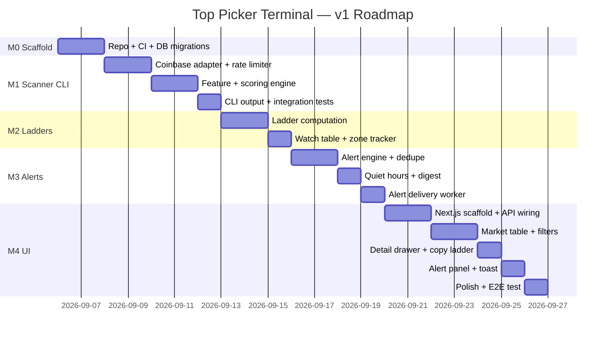

# Roadmap — Top Picker Terminal (TPT) v1

**Document version:** 1.0
**Date:** 2026-09-05
**Timezone for planning:** Africa/Nairobi (EAT, UTC+3)

---

## Overview

The v1 roadmap is structured around 5 milestones (M0–M4), each with a clear scope boundary, an effort estimate in developer-days, and explicit acceptance criteria (full detail in `docs/PRD.md §15`). One developer is assumed throughout.



**Total estimate: ~24 developer-days** (≈ 5 working weeks solo, with room for iteration)

---

## M0 — Scaffold

**Goal:** A runnable skeleton with all plumbing in place. No business logic yet.

**Effort:** 2 developer-days

### Scope

- [ ] Monorepo directory structure created (`backend/`, `frontend/`, `docs/`, `config/`)
- [ ] `pyproject.toml` with all backend dependencies declared (`uv` lock)
- [ ] `config/strategy.yaml` with all documented default values
- [ ] `.env.example` with all required environment variables
- [ ] SQLAlchemy models stub for all 9 tables
- [ ] Alembic initialized; initial migration script creates all tables
- [ ] `make db-migrate` command works
- [ ] `make serve` starts FastAPI on port 8000 (empty routes, /health returns 200)
- [ ] `tpt scan --dry-run` CLI command exists (prints "dry run" and exits)
- [ ] `pytest tests/` passes (zero tests, no failures)
- [ ] GitHub Actions CI: install deps → lint (ruff, mypy) → test
- [ ] Next.js app initialized with TypeScript; `npm run dev` starts on port 3000 (default Next.js template)
- [ ] `docker-compose.yml` that runs backend + frontend together (optional but stubbed)
- [ ] `README.md` with quick-start instructions

### Acceptance Criteria
See PRD §15 AC-M0.1 through AC-M0.5

---

## M1 — Scanner CLI

**Goal:** Working command-line scanner that fetches live data, computes features and scores, and logs results.

**Effort:** 5 developer-days

### Scope

#### Phase 1A — Coinbase Adapter (2d)
- [ ] `adapters/base.py` — `ExchangeAdapter` ABC with method signatures
- [ ] `adapters/coinbase.py` — async httpx client:
  - `get_products()` → filtered product list
  - `get_stats(product_id)` → 24h OHLCV
  - `get_ticker(product_id)` → last price, bid/ask
  - `get_candles(product_id, granularity, limit)` → OHLCV arrays
- [ ] Token-bucket rate limiter at 3 req/s (see ARCHITECTURE §5.1)
- [ ] Retry logic with exponential backoff on 429/5xx
- [ ] Concurrency: asyncio semaphore (max 10 parallel requests)
- [ ] Partial failure handling: stale flag per symbol

#### Phase 1B — Feature + Scoring Engine (2d)
- [ ] `engine/features.py`:
  - `compute_features(raw_stats, raw_ticker, raw_candles_1h, raw_candles_1d, btc_feature) → FeatureDict`
  - All features from DATA_MODEL §5
  - Division-by-zero guard for pos_in_range when day_high == day_low
- [ ] `engine/scorer.py`:
  - `score(features: FeatureDict, config: ScoringConfig) → ScoreBreakdown`
  - All components from PRD §9.2
  - Config-driven weights (no hardcoded constants)
- [ ] `engine/labeler.py`:
  - `label(features: FeatureDict, score: float, config: LabelingConfig) → Label`
  - Priority tree from PRD §9.1
- [ ] Unit tests: `test_scorer.py`, `test_features.py`, `test_labeler.py`
  - At least 5 known-input/known-output regression cases each

#### Phase 1C — Runner + CLI Output (1d)
- [ ] `scanner/runner.py` — orchestrates scan:
  - `run_scan(trigger: str) → ScanRunResult`
  - Two-phase candle fetch (non-candidates skipped)
  - Bulk DB writes (scan_run, snapshots, features, scores)
- [ ] `tpt scan` CLI command:
  - Calls `run_scan(trigger='ON_DEMAND')`
  - Prints progress bar
  - Outputs top 10 COILED/EARLY table to terminal
  - `--output json` flag writes full results to stdout
- [ ] Scheduler (`scanner/scheduler.py`) configured; scheduled run every `SCAN_INTERVAL_SECONDS`
- [ ] Integration test: mock Coinbase responses → verify DB state post-scan

### Acceptance Criteria
See PRD §15 AC-M1.1 through AC-M1.6

---

## M2 — Ladders

**Goal:** Ladder computation for candidates; zone watch lifecycle.

**Effort:** 3 developer-days

### Scope

#### Phase 2A — Ladder Engine (2d)
- [ ] `engine/ladder.py`:
  - `compute_ladder(features: FeatureDict, label: Label, config: LadderConfig) → Ladder | None`
  - Tranche A: `min(fib_50_62_midpoint, vwap_pocket_lower)`
  - Tranche B: `min(fib_786, swing_shelf_7d)`
  - Stop: `tranche_b * (1 - stop_pct)`
  - T1: `day_high * 0.995`
  - T2: `swing_high_7d` if available, else `day_high * (1 + target2_extension_pct / 100)`
  - Chase guard: if `label == CHASE` → return `None`
  - `basis` JSON constructed for auditability
- [ ] Unit tests for ladder: assert levels correct for given synthetic features

#### Phase 2B — Watch Table (1d)
- [ ] `alerting/zone_tracker.py`:
  - `open_watch(symbol, zone, zone_price, ladder_id)`
  - `close_watch(watch_id, close_reason, exit_price)`
  - `get_active_watches() → List[Watch]`
  - `detect_zone_entry(features, ladder) → ZoneEvent | None`
  - `detect_zone_exit(features, watch) → bool`
- [ ] DB operations for watches, wired into `scanner/runner.py`
- [ ] `tpt scan --output json` includes ladder levels for each candidate

### Acceptance Criteria
See PRD §15 AC-M2.1 through AC-M2.5

---

## M3 — Alerts

**Goal:** Alert generation, deduplification, quiet hours, and morning digest.

**Effort:** 4 developer-days

### Scope

#### Phase 3A — Alert Engine + Dedupe (2d)
- [ ] `alerting/alerter.py`:
  - `generate_alerts(scan_result, prev_watches, config) → List[AlertRecord]`
  - Dedupe key construction: `"{symbol}:{alert_type}:{round(zone_price, 3)}"`
  - Dedupe query: last delivered alert with same key within `dedupe_hours`
  - Zone re-entry resets dedupe: watch `closed_at` IS NOT NULL → clock reset
  - All 5 alert types (ZONE_A_ENTRY, ZONE_B_ENTRY, ZONE_A_APPROACH, BREAKOUT_WATCH, INVALIDATION)
- [ ] Persist `AlertRecord` for every candidate (even suppressed)
- [ ] Unit tests for dedupe logic:
  - Same alert within 6h → suppressed
  - Price left and re-entered → fires
  - First scan of day → no alerts (baseline population only)

#### Phase 3B — Quiet Hours + Digest (1d)
- [ ] `alerting/delivery.py`:
  - `should_deliver(alert, now_nairobi) → bool` (quiet hours check)
  - `mark_delivered(alert_id)` → sets `delivered_at`
  - `get_pending_alerts() → List[AlertRecord]` (undelivered, non-dismissed)
  - `deliver_digest(pending_alerts)` → creates DIGEST record; marks originals delivered
- [ ] Scheduler job runs delivery worker every 60s
- [ ] Digest fires at 08:00 Nairobi if any suppressed alerts exist

#### Phase 3C — FastAPI Alert Routes (1d)
- [ ] `GET /api/v1/alerts` — paginated, filterable
- [ ] `GET /api/v1/alerts/pending` — undelivered
- [ ] `PATCH /api/v1/alerts/{id}/dismiss`
- [ ] Integration test: simulate zone entry → verify alert in DB → verify quiet-hour suppression

### Acceptance Criteria
See PRD §15 AC-M3.1 through AC-M3.5

---

## M4 — UI

**Goal:** Browser dashboard with market table, detail drawer, and alerts panel.

**Effort:** 7 developer-days

### Scope

#### Phase 4A — Next.js Scaffold + API Wiring (2d)
- [ ] Next.js 14 (App Router) with TypeScript initialized
- [ ] `src/lib/api.ts` — typed API client wrapping all `/api/v1/` endpoints
- [ ] `@tanstack/react-query` configured with stale-time = 5s
- [ ] FastAPI CORS middleware allows `localhost:3000`
- [ ] `/health` probe shows backend status in UI header
- [ ] All API routes implemented and tested (see PRD §12)
- [ ] `/api/v1/markets` returns joined latest scores + features for UI table

#### Phase 4B — Market Table (2d)
- [ ] Sortable table columns: Symbol, Last, 24h%, Score, Label, PIR, Volume
- [ ] Label badge with color coding:
  - COILED = blue, EARLY = green, ENTRY_ZONE = gold, WATCH = gray, CHASE = red, SKIP = muted
- [ ] Position-in-range progress bar (4 segments, color-coded at 0.40 and 0.75 thresholds)
- [ ] Label filter chips (multi-select; default shows all except SKIP)
- [ ] Score sort (DESC default)
- [ ] Table auto-refreshes when `scan/status` transitions from RUNNING → DONE
- [ ] Scan status bar: "Last scan: HH:MM EAT · N pairs · M candidates · [status]"
- [ ] "Scan Now" button (disabled while RUNNING; shows spinner)

#### Phase 4C — Detail Drawer (1d)
- [ ] Right-side drawer opens on row click (keyboard accessible)
- [ ] Sections: header (symbol, label, score), Ladder, Features, Score Breakdown
- [ ] "Copy Ladder Text" button — copies formatted text (from PRD §13.4)
- [ ] Clipboard copy confirmation toast
- [ ] Drawer tracks selected symbol; updates live on re-scan

#### Phase 4D — Alert Panel (1d)
- [ ] Left or top panel showing last 20 alerts
- [ ] Each alert shows: symbol, alert_type badge, price, zone price, timestamp (Nairobi TZ)
- [ ] "View Ladder" link opens detail drawer for that symbol
- [ ] "Dismiss" button calls `PATCH /alerts/{id}/dismiss`
- [ ] In-app toast notification for new alerts (polled every 10s)
- [ ] Digest banner: "N alerts while you slept" with expand button

#### Phase 4E — Polish + E2E (1d)
- [ ] Dark mode default (respects `prefers-color-scheme`)
- [ ] Responsive layout (usable at 1280px+ width)
- [ ] Loading skeletons for table and drawer
- [ ] Error boundary for API failures with retry button
- [ ] Playwright E2E test: scan → table updates → click row → drawer opens → copy ladder

### Acceptance Criteria
See PRD §15 AC-M4.1 through AC-M4.6

---

## Post-v1 Backlog (Prioritized)

| Priority | Feature | Estimated Effort |
|---|---|---|
| P1 | Telegram alert delivery | 1–2d |
| P1 | Windows native toast notifications (via OS notification API) | 1d |
| P1 | Alert history view + filter page | 2d |
| P1 | MEXC exchange adapter | 3d |
| P2 | Manual trade log + P&L tracker (vs ladder entries) | 3–5d |
| P2 | 7d scanner trend context (BTC dominance, altcoin index) | 2d |
| P2 | Coinbase WebSocket (real-time price feed vs poll-based) | 3d |
| P3 | Postgres migration + persistent deployment | 1d |
| P3 | Multi-profile support | 5d+ |
| P3 | Mobile PWA wrapper | 3d |

---

## Dependency Map

```
M0 (Scaffold)
  └─► M1 (Scanner CLI)
        └─► M2 (Ladders) ──────────┐
              └─► M3 (Alerts) ─────►  M4 (UI) — first usable product
```

Each milestone is a working, independently testable increment. M1 is the first milestone that provides value (actionable terminal output). M4 is the first milestone that is user-facing.

---

## Risk-Adjusted Effort

| Risk | Contingency Buffer |
|---|---|
| Coinbase API behaviour different from docs | +1d on M1 |
| SQLite async write contention under load | +1d on M1-M2 if WAL issues appear |
| Windows-specific path bugs (uv, SQLite) | +0.5d on M0 |
| React-query + Next.js App Router compatibility | +1d on M4 |
| **Total buffer (recommended)** | **+3.5d** |

**Conservative total: ~28 developer-days** (~6 working weeks solo)

---

*End of ROADMAP.md v1.0*
